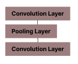
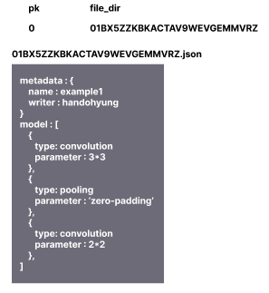
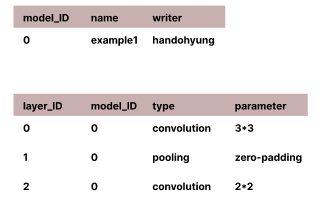
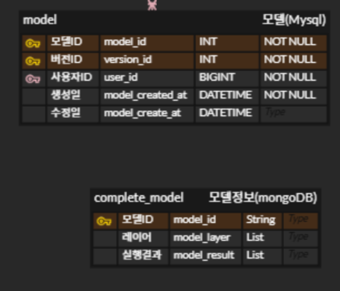

# 딥러닝 모델의 데이터 저장과 관련한 DB 선택

- SSAFY 자율 프로젝트 `<SCV>` 중 발생한 고민을 문서화 하였다.
- `<SCV>`는 딥러닝 학습 플랫폼이다.
- 가벼운 Computer Vision 모델을 블록으로 구현하고 이를 파이썬 코드로 변환해 학습과 테스트를 거쳐 사용자에게 보여준다.

## 요구사항

- 모델의 메타데이터 (작성자, 수정날짜 등)를 저장한다.
- 모델의 각 layer에 대한 정보 (레이어 이름, 파라미터 종류와 값) 를 저장한다.
- **모델의 CRUD가 빈번하다.**
- 학습된 모델의 가중치 데이터는 기본적으로 저장하지 않는다.
- 그러나, 모델이 학습된 직후에 사용자가 임의로 제출한 1개의 데이터에 대해서는 추론을 허용한다.

### AI 관련 기능 목록

- 유사도 기반 모델 추천과 분석 (요청할 때마다 새로운 모델 Pool에 대해 다시 실행)

  - VectorDB
    - FAISS : 파이썬 내부
    - Annoy : 파이썬 내부
    - **Milvus : 독립적인 컨테이너화 가능, 다른 컨테이너 접근 용이** `채택`

- 모델 정적 분석 (학습 시에 최초 한번만 실행)
  - 정량 지표 (파라미터 개수)
  - 정성 지표 (시각화)
  - **mongoDB : NoSQL 진영으로 분리해 사용** `채택`
  - Postgresql (JSONB 타입 지원)

## 구상

- 다음의 모델을 저장하고 싶다 했을 때

  

### JSON 방식

- RDBMS에는 JSON 파일의 이름을 저장 (ULID, 시간순 정렬 가능하게)
  - Postgresql 같은 경우 JSONB 타입을 지원하기 때문에 파일로 따로 저장할 필요도 없다.

### DB 방식

- 각 layer를 tuple로 만들고, layer의 위치정보를 layer_ID로 저장

#### 문제점

- Join이 너무 많이 필요함
- 모델의 CRUD가 빈번한데 각 행마다 조회해서 Update하기가 어려움

## 결론

- 모델의 layer 구성은 JSON 형식으로 MongoDB에 저장한다.
- 모델의 Metadata는 RDBMS에 저장한다.

이렇게 함으로써 화면에 모델 목록을 뿌려줄 떄는 RDBMS에서 메타데이터로만 Body를 구성해 응답해주고, 사용자가 모델 개발 화면에 들어갔을 때 MongoDB에 `모델_ID + 버전_ID`를 키로 모델의 구조를 받아서 응답한다.

즉,

- REST API 호출 타이밍에 필요한 데이터가 무엇인지에 집중하였다.
- JSON 타입이 필요한 데이터에 대해서만 MongoDB에 저장하였다.
