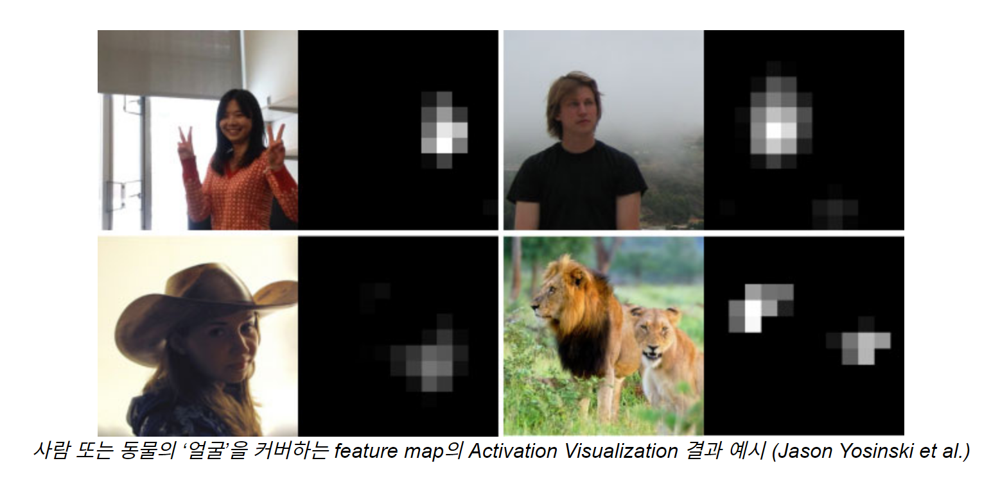
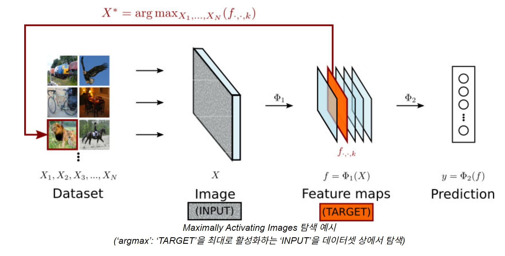
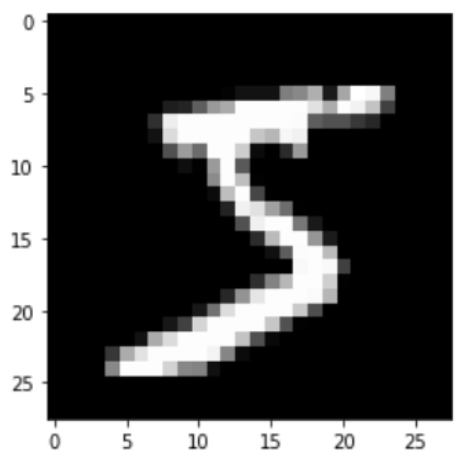

# 딥러닝 모델의 분석 과정에서 생기는 이미지 파일들을 어떻게 프론트한테 전달할까?

- 모델 `json`
  - 블록뷰 `json`
  - 코드뷰 `string`
- 데이터 셋 ( MNIST, Fashion-MNIST, CIFAR-10, CIFAR-100, …) `ENUM` ~~~~( RDB 에 컬럼으로)
- 최종 Dataset Accuracy `float`
- Train epoch 당 Loss, Accuracy `float`
- Test set Loss,Accuracy `float`
- 해당되는 Layer 마다 Parameter 개수 (torch summary) `int`

- **해당되는 Layer 마다 Feature Activation 이미지 시각화**
- **해당되는 Layer의 Activation Maximization 이미지 `int : index of dataset`**
- ~~해당되는 Layer 마다 Kernel 이미지 시각화~~
- Confusion Matrix 시각화 `array(label*label)`
- **대표 오답 케이스 시각화 (각 matrix에서 label에서 1장씩?) `int : index of dataset`**
- 유사도 기반 모델 추천 `model_id` : latency 비교해서 고정할지 매번 생성할 지
  - 추천된 모델과의 정성적 비교 (gpt 4o-mini) `string` : 매번 api 호출해서 새로 렌더링
  - 블록뷰 `json`
  - Test set Accuracy `float`

## 요구사항

- 위에 열거한 사항들은 "모델 학습결과 분석 페이지"에서 렌더링할 사항들이다.
- 그 중에서 이미지 데이터에 대한 것이 문제가 되었다.

### 1. 해당되는 Layer 마다 Feature Activation 이미지 시각화

활성 함수 레이어에서 뽑아 낼 수 있는 이미지 시각화이다. 모든 레이어에서 각각 생성되어야 한다.

### 2. 해당되는 Layer의 Activation Maximization 이미지

레이어의 활성함수 출력값을 최대화하는 이미지를 가지고 있는 1. 데이터셋 상에서 찾을 수도, 2. 직접 생성할 수도 있다. 후자는 "Deep Dream" 이라고도 불린다. 지금 당장의 프로젝트에서는 1번을 사용할 것 같다.

### 3. 대표 오답 케이스 이미지

Confusion matrix 상에서 오답수가 가장 많은 칸? 에서 하나의 데이터를 뽑아서 이미지로 보여준다.

---

## 특이사항

- 1번은 생성되는 이미지이고, 2번, 3번은 있는 데이터 셋 에서 고르는 것이다.
- 데이터셋은 숫자이기 때문에 이를 이미지로 변환하는 과정이 필요하다.

## 구상

### (내 아이디어) File System

1. 프론트에서 바라보는 데이터셋 목록과 FastAPI에서 바라보는 데이터셋 목록을 동기화 (같은 인덱스면 같은 데이터) 한다.

2. FastAPI 에서 화면에 출력해야 하는 데이터 셋의 Index를 주면

3. 프론트에서 해당 데이터 (2차원 숫자 배열일수도, .jpg 파일 일수도) 를 읽어와 렌더링한다.

- 숫자 배열을 모두 .jpg 파일로 전환해 놓은 스토리지나 볼륨이 있다고 가정하면,
- 2번과 3번 기능에 적용하면 복잡한 데이터 전송 없이도 이미지를 골라올 수 있다.
- 1번은 새로운 이미지 데이터를 생성해야 하는데, 해당 볼륨을 프론트에서도 볼 수 있어야 한다는 점과, 계속해서 새로운 이미지가 생성되어 쌓여야 한다는 점이 단점이다.
  (FastAPI 컨테이너는 GPU 서버에, 프론트 컨테이너는 기존 CPU 서버에 존재한다.)

### (팀원 아이디어) 28\*28 기준 784개의 Int형 데이터를 http 바디에 담는다.

- 결과를 body에 실어서 주면, 프론트에서 알아서 렌더링한다.
- 1px\*1px의 div 를 사용해서 우리만의 커스텀 이미지를 직접 생성하는 방식을 써볼 수 있겠다.

- 파일 입출력이 필요 없다.

- 프론트 렌더링 부담이 심하진 않을..까?

> 후에 matplotlib이 어떻게 렌더링하는지 찾아봤다.
> matplotlib 에서는 두가지의 백엔드를 사용하는데, 상호작용형 API(TkAgg) 와 파일 입출력 형식의 API(Agg)이다.
> 특히 상호작용형 API의 경우 위 내용과 비슷하게 객체를 pixel 단위의 렌더링으로 변환하는 과정이 있다고 한다.

## 결론

10. 24 팀원과 회의를 거쳐 결정해야겠다.
